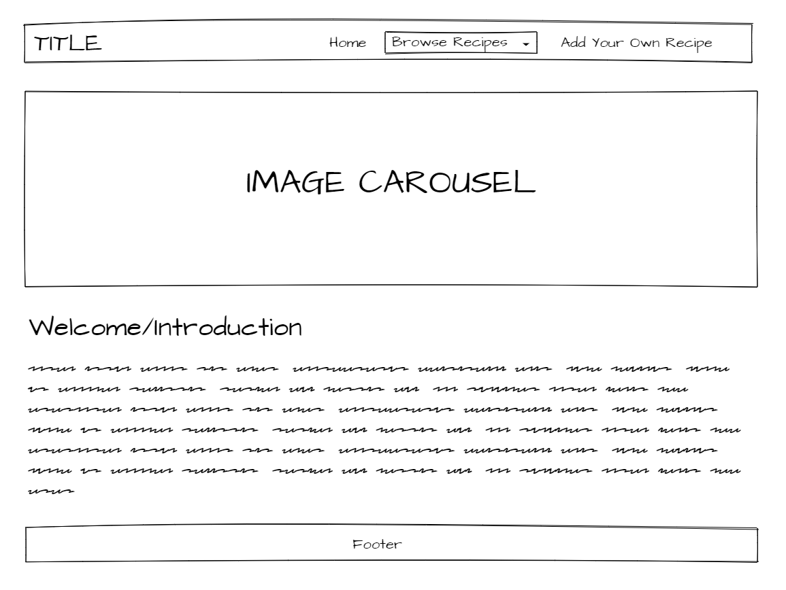
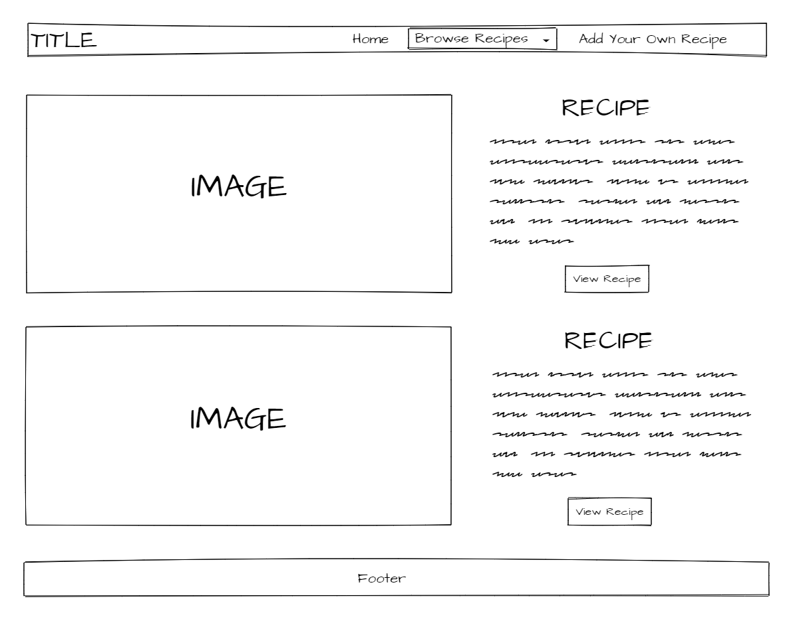
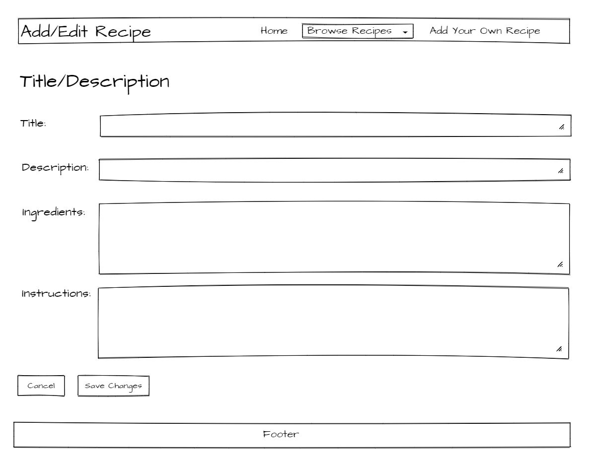
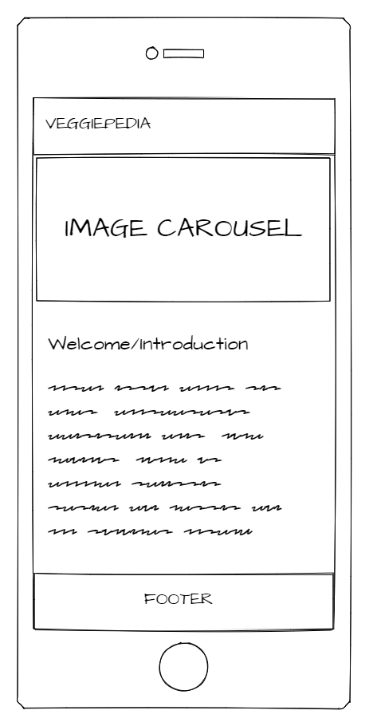
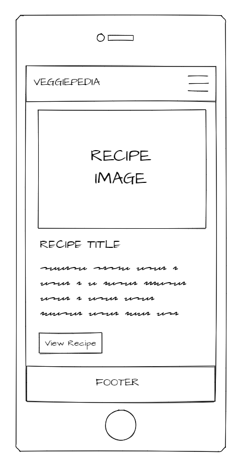
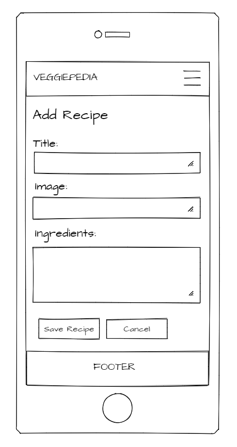

# VeggiePedia

 

## Table Of Contents

- General Information
- Demo
- Wireframe Mockups
- Technologies
- UI
- UX
- Database
- Accessibility
- Challenges
- Features
- Defensive Design
- Testing
- Deployment
- Credits

 

## General Information

### Code Institute Coding Bootcamp - Data Centric Development Milestone Project

This is my third milestone project for my Coding Bootcamp at Code Institute.

The idea behind VeggiPedia is to create a huge database of vegeterian recipes with the help of its users, similar to wikipedia,
but for vegetarian recipes.

Switching to a vegetarian diet can be a challenge for many as most recipes over the recent decades have been meat based.

Thus, finding a large collection/resource of different vegetarian recipes can be a tricky endeavour.

This is where a website like VeggiePedia can make a differenc by building one of the largest collections of recipes available with the help of its users.

 

## Demo

A live demo of the website can be found [here](https://codei-cook-book.herokuapp.com/).

 

## Wireframe Mockups

<table>
    <tr>
        <td>Index Page - Large Screen</td>
        <td>View Recipes Page - Large Screen </td>
        <td>Edit/Add Recipe Page - Large Screen </td>
    </tr>
    <tr>
        <td>Index Page - Small Screen </td>
        <td>View Recipes Page - Small Screen </td>
        <td>Edit/Add Recipe Page - Small Screen </td>
    </tr>
</table>

 

## Technologies

### Languages

- HTML5
- CSS3
- Javascript
- Python3

### Libraries

- Bootstrap CSS 4.3.1
- Bootstrap JS 4.3.1
- FontAwesome 4.7.0
- jQuery 3.4.1
- Dnspython 1.16.0
- Flask 1.1.1
- Flask-PyMongo 2.3.0
- PyMongo 3.10.1

### Tools

- MongoDB

### Hosting

- Github
- Heroku

 

## UI

### Colors, Fonts & Layout

The overall layout of the page is aimed to be minimalistic in order to give the recipes and forms as much attention and real estate as possible.

The goal of the color combination used was to mimic the colors found in many vegetarian dishes in combination with a font that reminds of a
hand written recipe notebook.

### Responsiveness

The website has been built with a mobile-first approach and is highly responsive.

This is primarily achieved by using bootstrap and custom-written css (for more details see testing section).

 

## UX

The overall goal of the website is to provide visitors looking for vegetarian recipes with a intuitive and simple site and a large database of recipes.

The websites focuses on 3 main categories of recipes: Breakfast, Main Dishes & Desserts. Users are allowed to both edit/update recipes based on their experience
when preparing the meal but also delete unwanted recipes. For the delete button a strong red color was used as a warning color along with a pop up alert asking
the user for a second confirmation since deleted recipes cannot be recovered.

The add recipe form displays placeholder text in all formfields to give the user instructions for easier input.

The edit recipe form is pre-populated with the recipe information that is pulled from the database.

### User Stories

- As a user, I want to be able to add my own recipes to the database. (Create)
- As a user, I want to browse a large collection of vegetarian recipes. (Read)
- As a user, I want to be able to edit recipes. (Update)
- As a user, I want to be able to delete recipes. (Delete)

Future user stories/functions (TBA):

- As a user, I want to create my own profile/login where I can store my own recipe collection. (TBA)
- As a user, I want to be able to vote on recipes in the database. (TBA)
- As a user, I want to be able to comment on recipes in the database. (TBA)
- As a user, I want to be able to quickly share recipes with my friends on social media. (TBA)
- As a returning user, I want to be able to edit and delete my own recipes in my personal recipe collection. (TBA)
- As a admin user I want to be able to edit and delete any recipe in the database. (TBA)

 

## Database

The database chosen for this is a non-relational database hosted on MongoDB.

The application uses 2 database collections, 'categories' and 'recipes'.

The basic information of each recipe (category, title, image-link, description) is stored as a key value whilst the content of the ingredients and instructions for each recipe are stored as an array.

The idea behind the array is to be able to better structure the output of the ingredients and instructions data in the recipe view.

This is achieved by the user segregating each ingredient/instruction in the add/edit recipe form using a line break (hit enter after each ingredient/instruction).

The user is instructed to do this via the placeholder text in the applicable textarea on the edit/add recipe page.

The textarea content is then split using "/n" and saved as an array in the database.

The reverse is applied "/n.join" to pre-populate the textarea formfields when editing a recipe.

The view recipe page applies a for each function to combine each array item into a collection of ingredienst/instructions to the user.

 

## Accessibility

To increase accessibility of the website, ALT attributes have been added to carousel images.

 

## Challenges

My overall experience when creating this application was smooth and straight forward in terms of database, routing, layout, design and responsiveness.

The biggest challenge for me was to create and work with arrays instead of only key values in the database, how to split the user input
and join it back together when pre-populating the edit recipe formfields.

With the help of my Code Institute mentor I was able to work this out.

 

## Features

### Feature Overview

- Users can add their favorite vegetarian recipes to the database. (Create)
- Users can browse through all recipes contained in the database. (Read)
- Users can edit  recipes in the database. (Update)
- Users can delete recipes in the database. (Delete)

### Feature 1 - Add Recipes (Create)

**User story: "As a user, I want to be able to add my own recipes to the database."**

Users can easily add new recipes to the database by navigating to the 'add recipe' page and completing the form.

The **Select Category** field allows users to select a category for the recipe. This field contains pre-selections populated by the categories
available in the database which restricts users from entering an incorrect category.

The **Recipe Name** field allows the user to add a name/title of the recipe.
This field has a restriction of maximum 100 characters so the user cannot upload an infinite amount of text.

The **Recipe Image** field allows the user to add a image link to the recipe image.
This field does only accept strings containing a correct url address (front-end validation).

The **Recipe Description** field allows the user to enter a recipe description.
This field has a restriction of maximum 1000 characters so the user cannot upload an infinite amount of text.

The **Ingredients** field allows the user to enter recipe ingredients.
This field has a restriction of maximum 3000 characters so the user cannot upload an infinite amount of text.

The **Instructions** field allows the user to enter recipe instructions.
This field has a restriction of maximum 3000 characters so the user cannot upload an infinite amount of text.

The add recipes form currently uses front-end validation to make sure the user completes all mandatory formfields, does not upload
an infinite amount of text and enters a valid image recipe link.

### Feature 2 - Browse Recipes (Read)

**User story: "As a user, I want to browse a large collection of vegetarian recipes."**

Users can select to view a specific category of recipes by using the main navigation and dropdown menu (Breakfast, Main, Dessert).

The recipe category page displays a minimized view of all recipes (recipe cards) contained in the applicable category in the database (Title, Image, Description).

From this page, the user can select a specific recipe by clicking on the 'view recipe' button and is then presented with a full-page view of the recipe and all its details.

### Feature 3 - Edit Recipes (Update)

**User story: "As a user, I want to be able to edit recipes."**

From the view_recipe page, the user can select to edit the applicable recipe by clicking on the 'edit recipe' button.

This takes the user to a form that is pre-populated with the recipe information which the user then can use to update the recipe.

The **Select Category** field allows users to select/change the category of the recipe. This field contains pre-selections populated by the categories
available in the database which restricts users from entering an incorrect category.

The **Recipe Name** field allows the user to change the name/title of the recipe.
This field has a restriction of maximum 100 characters so the user cannot upload an infinite amount of text.

The **Recipe Image** field allows the user to edit or change the image link to the recipe image.
This field does only accept strings containing a correct url address (front-end validation).

The **Recipe Description** field allows the user to edit or update the recipe description.
This field has a restriction of maximum 1000 characters so the user cannot upload an infinite amount of text.

The **Ingredients** field allows the user to edit or update the recipe ingredients.
This field has a restriction of maximum 3000 characters so the user cannot upload an infinite amount of text.

The **Instructions** field allows the user to edit or update the recipe instructions.
This field has a restriction of maximum 3000 characters so the user cannot upload an infinite amount of text.

Once the user is done with editing the information, the user is left with 2 choices, to update the recipe by clicking the 
'update recipe' button or canceling the update process by clicking 'cancel'. Clicking on 'update recipe' confirms the user
selection via an on-screen alert. Clicking on 'cancel' also confirms the user selection via a different on-screen alert
and takes the user back to the recipe page.

The edit recipes form currently uses front-end validation to make sure the user completes all mandatory formfields, does not upload
an infinite amount of text and enters a valid image recipe link.

## Feature 4 - Delete Recipes (Delete)

**User story: "As a user, I want to be able to delete recipes. (Delete)"**

From the view_recipe page, the user can select to delete the applicable recipe by clicking on 'delete recipe'.

Clicking on the 'delete recipe' button brings up an on-screen alert requiring the user to confirm their choice.

Clicking on 'OK' deletes the recipe and confirms this via a new on-screen alert. Clicking on 'cancel' does not delete the recipe which also is confirmed via a new on-screen alert.

### Features Left To Implement

Going forward I would like to implement the following features:

- Storing user data: Storing user data (username) for each recipe, connecting the recipe to the user that created it.
- Login feature: Enabling users to create an account and log in using their chosen credentials.
- Restrict edit/delete: Only enabling logged in admins or logged in users owning a recipe to edit/delete them.
- Search feature: Allowing users to search for specific categories or recipes in the database.
- Sharing feature: Create social share buttons for users to share a recipe on social media.
- Rating feature: Enabling users to vote on recipes.
- Comment section: Enabling users to comment on shared recipes.
- Backend Validation: Add further backend validation to further add to defensive design.
- Image upload feature allowing users to upload images instead of just adding image links.
- Admin approval of new content, meaning a admin level user has to approve new recipes added before they become publicly available.

 

## Defensive Design

The main concern when building this application from a defensive design standpoint was to limit the user from being able to spam the database.

For this project, to display my understanding and skill of the CRUD functionality I've allowed any user to add/edit/delete recipes.

A future feature I'm looking to add is to restrict regular users from editing/deleting a recipe by connecting each recipe to a user, meaning
only the creator/owner of a recipe can edit or delete it, alternatively a admin type user can edit/delete any recipe.

For now, this application only uses front-end data validation via the formfield attributes (max # of characters, only accepting valid url, etc.).

This ensures the amount of data for each recipe is limited/controlled, but the content of the data is not.

A user could upload any text (for example offensive text) into the database at this point.

This is why I'm looking to add back-end data validation in the future along with a manual approval from a admin user before the uploaded recipe/information is made publicly available.

*For details on defensive design testing, please see testing section.

 

## Testing

### Manual Testing

**Test:** Clicking on the navbar logo and 'home' navigation link in the navbar should navigate to the home page.

**Result:** Tested on all pages. No errrors. Works as intended.

**Test:** Clicking on the different recipe category links in the navigation bar should navigate to the view_recipe_category page and display the correct category.

**Result:** Tested on all pages. No errrors. Works as intended.

**Test:** Clicking on the 'Add Your Own Recipe' link in the navbar should navigate to the add_recipe page.

**Result:** Tested on all pages. No errors. Works as intended.

**Test:** Clicking on the 'view recipe' button on the view_recipe_category page should navigate to the view_recipe page and display all database information for the chosen recipe.

**Result:** No errors. Works as intended.

**Test:** Clicking on 'edit recipe' on the view_recipe page should navigate to the edit_recipe page and pre-populate all formfields with the recipes database information.

**Result:** No errors. Works as intended.

**Test:** Changing any of the recipe information on the edit_recipe page and clicking on the 'update recipe' button should bring up an alert, save the updated information to the database and navigate back to the view_recipe page.

**Result:** No errors. Works as intended.

**Test:** Clicking on the 'cancel' button on the edit_recipe page should bring up an alert and not update any information in the database and navigate back to the view_recipe page..

**Result:** No errors. Works as intended.

**Test:** Clicking on the 'delete recipe' button on the view_recipe page should bring up an alert asking the user for confirmation to delete the recipe.

**Result:** No errors. Works as intended.

**Test:** Confirming to delete the recipe should bring up an alert confirming that the recipe has been deleted and navigate back to the homepage.

**Result:** No errors. Works as intended.

**Test:** Pressing 'cancel' on the confirm delete alert should not delete the recipe and bring up another alert stating that the recipe has not been deleted.

**Result:** No errors. Works as intended.

**Test:** On the add_recipe and edit_recipe pages, adding a invalid url into the image link field should result in an error, stating that the string is not a valid url.

**Result:** Error displays correctly.

**Test:** Textfields and textareas on the add_recipe and edit_recipe pages should only allow for maximum number of characters to be added (100, 1000 & 3000).

**Result:** Character limit works as intended.

**Test:** Leaving the mandatory formfields empty on the add_recipe and edit_recipe pages should result in an error, stating that the user has to enter some information.

**Result:** Error displays correctly.

**Test:** Clicking on the 'Submit Recipe' button on the add_recipe page should update the database accordingly and navigate to the added recipe page (view_recipe).

**Result:** No errors. Works as intended.

**Test:** Clicking on the 'Cancel' button on the add_recipe page should navigate back to the homepage.

**Result:** No errors. Works as intended.

**Test:** Using the browsers 'back' button does not break any of the application functions.

**Result:** No errors observed.

### Code Validation

Filename                    | Code      | Validator                             | Outcome/Comments
----------------------------|-----------|---------------------------------------|-----------------
app.py                      | Python3   | http://pep8online.com/                | First test failed with 30+ errors (Identation, white space, long lins). Second test passed with 0 errors.
style.css                   | CSS3      | https://jigsaw.w3.org/css-validator/  | First test passed with 0 errors.
add_recipe.html             | HTML5     | https://validator.w3.org/             | First test failed with 1 error (unclosed div). Second test passed with 0 errors.
base.html                   | HTML5     | https://validator.w3.org/             | First test failed with 1 error (stray script tag). Second test passed with 0 errors.
edit_recipe.html            | HTML5     | https://validator.w3.org/             | First test failed with 1 error (unclosed div). Second test passed with 0 errors.
index.html                  | HTML5     | https://validator.w3.org/             | First test failed with 1 error ("\" used for image src instead of "/"). Second test passed with 0 errors.
view_recipe_category.html   | HTML5     | https://validator.w3.org/             | First test failed with 1 error (stray span tag). Second test passed with 0 errors.

### Responsive design:

The application has been build with a mobile-first approach and throughout the development process, chrome developer tools, multiple PC's and mobile devices
where used to ensure responsivness across all screen resolutions.

The application was also tested by friends and family accross multiple devices and browsers.

For final testing [Responsinator](https://www.responsinator.com/) was used to test the application accross multiple devices.

On the view recipe page, each recipe is presented on a row split into two divs, with the image taking up <20% of the row.

This means recipe images ideally should be vertically represented, meaning a greater height than width.

Since users can upload any type of image via the add/edit recipe pages, I applied a fixed width to the images using css to ensure wide images do not impact the overall design of the page.

### Screen Size Testing/Compability

Screen Size         | Size              | Comments
--------------------|-------------------|---------
X-Small             | <768px            | No space between card-title and image. Padding added to rectify this on small screens.
Small               | >=768px           | No space between card-title and image. Padding added to rectify this on small screens.
Medium              | >=992px           | Passed, no changes needed.
Large               | >=1200px          | Passed, no changes needed.

### Browser Compability

Browser             | Version           | Comments
--------------------|-------------------|---------
Firefox             | 72.0.2 (64-bit)   | No errors observed
Edge                | 44.18362.449.0    | No errors observed
Chrome              | 80.0.3987.122     | No errors observed
Opera               | 67.0.3575.31      | No errors observed

### Navigation

Navigation was kept simple with a fixed navbar at the page top in order to give the body as much real estate as possible.

On screens bewow 768px the navigation links are replaced by a nav-toggler to adjust for the lesser screen space available.

The navbar brand logo is located in a classic top left corner location. When clicked the user will be returned to the homepage.

 

## Deployment

The project is stored in a GitHub  [repository](https://github.com/3PU/cook-book-milestone-project) and hosted on [Heroku](https://codei-cook-book.herokuapp.com/).

**How to deploy to Github:**

1. When logged into GitHub, navigate to the repository you want to host/publish. For this project, click [here](https://github.com/3PU/cook-book-milestone-project).
2. Click on 'Settings' to the far right in navigation menu below your repository name.
3. Scroll down to 'GitHub Pages' and select 'master branch' as the **source**.
4. Click **save**.
5. The link to the site hosted on GitHub Pages should appear at the top of the section.

**How to clone this repository in order to run the code locally on your machine:**

1. When logged into GitHub, navigate to the repository you want to clone. For this project, click [here](https://github.com/3PU/cook-book-milestone-project).
2. Click on the **'Clone or download'** button which should be displayed above and to the right of the repository files.
3. You are presented with a HTTPs address. Copy this address by pressing the button to the right of the address.
4. Open your terminal.
5. Change the current working directory to the location where you want the cloned directory to be made.
6. Type **'git clone'** and then paste the URL you copied.
7. Press **Enter** and your local clone will be created.

**How to deploy to Heroku using GitPod:**

1. Created a new application using the Heroku dashboard.
2. Go to settings tab, click on 'reveal config vars' and add config vars such as IP (0.0.0.0), PORT (5000), MongoDB Name, MongoDB URI (URL with DB name and password).
3. Install Heroku via the console using 'npm install -g Heroku'.
4. Log into Heroku via the console using 'heroku login' and follow the on screen instructions to log in.
5. Create a requirements.txt via the console using 'pip3 freeze > requirements.txt'.
6. Create a Procfile via the console using 'echo web: python app.py > Procfile'.
7. Connect GitHub to Heroku via the console using 'heroku git:remote a codei-cook-book'
8. Commit all files in your project via the console using 'git add .' and 'git commit -m "Message"'.
9. Deploy your project to Heroku via the consol using 'git push heroku master'.

**Running the application locally using Gitpod:**

1. Clone the repository as outlined above and upload it to GitPod.
2. Install the necessary libraries specified in the requirements.txt.
3. Set your environment variables by creating and adding them into a env.py file.
4. Create a .gitignore file in the root directory and add the env.py file to avoid it being pushed to GitHub.
5. Import the env.py file into the app.py file.
6. Run the application.

 

## Credits

### Content

All of the text content on the website was written by me.

### Media

The static images used accross the page were obtained from [Pexels](https://www.pexels.com/) and [Google Images](https://images.google.com/).

The recipes that I've added to the database in order to display the functionality of the application are borrowed from one of my favorite
vegetarian recipes website [Cookie & Kate](https://cookieandkate.com/) 

### Acknowledgements

A very big thank you goes to my Code Institute Mentor Brian M. for his invaluable support and guidance throughout this project.

### Disclaimer

The content of this website is for educational purposes only.